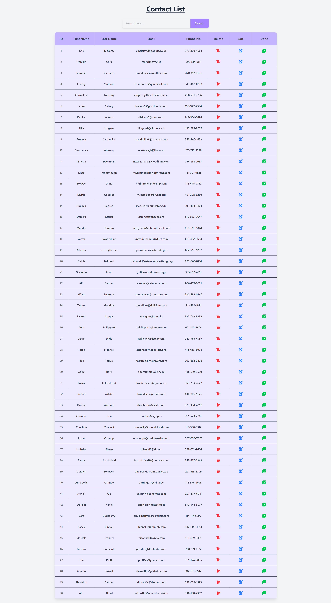
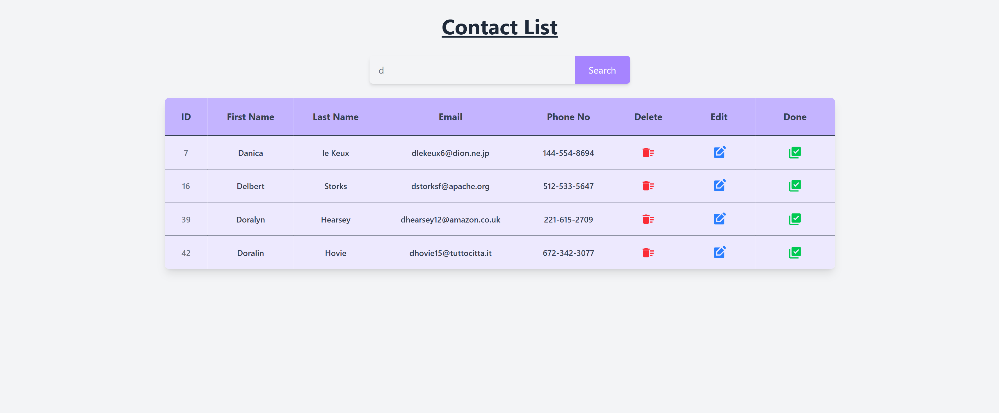
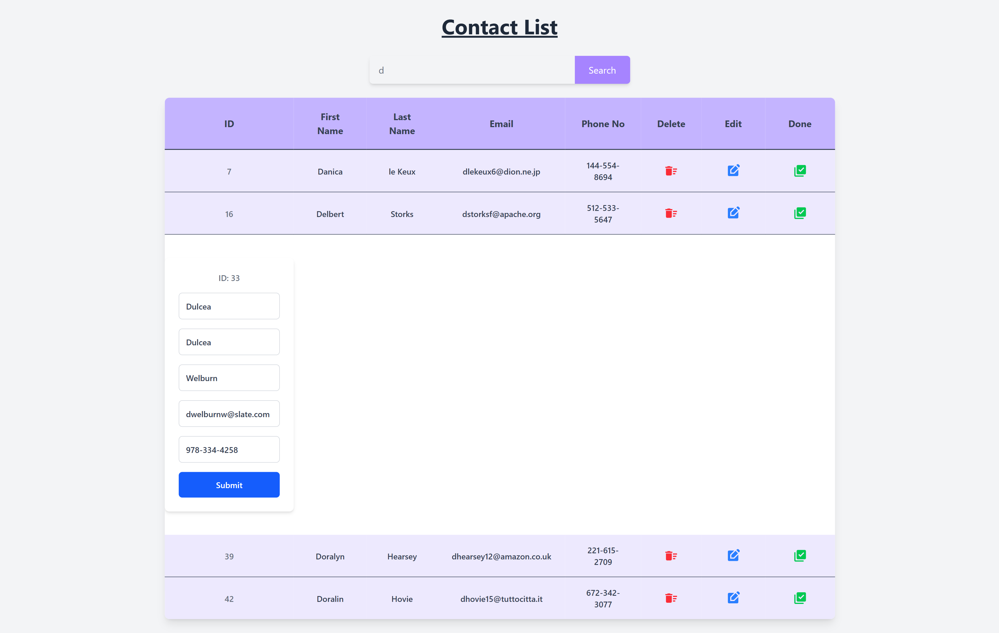
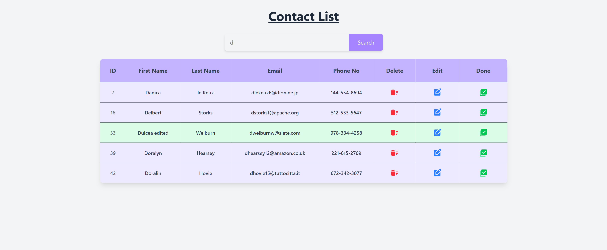

# Contact List App

A simple contact list manager built with **React** and styled using **Tailwind CSS**. This app allows users to:

- 🔍 Search contacts by first name
- 📝 Edit contact details
- ❌ Delete individual contacts
- ✅ Mark contacts as "Completed" for identification

> ⚠️ **Note**: This application is **not responsive** and is best viewed on large screens (desktops/laptops). It is not optimized for mobile or tablet devices.

---

## ✨ Features

- **Search** by first name (case-insensitive)
- **Edit** contact entries inline
- **Delete** individual contacts
- **Mark as Done** — visually highlights the contact row to show it is completed
- Styled entirely with **Tailwind CSS**

---

## 🛠 Tech Stack

- [React](https://reactjs.org/) (Functional Components + Hooks)
- [Tailwind CSS](https://tailwindcss.com/)
- [Material UI](https://mui.com/material-ui/material-icons/)(for adding icons)

## Screenshots

- Full List
  

- Searched List
  

- Editing List
  

- Marked the edited List
  

- Deleted the marked List
  

## Demo Link

[Live Demo](https://r-react-contactlistapp.netlify.app/)
